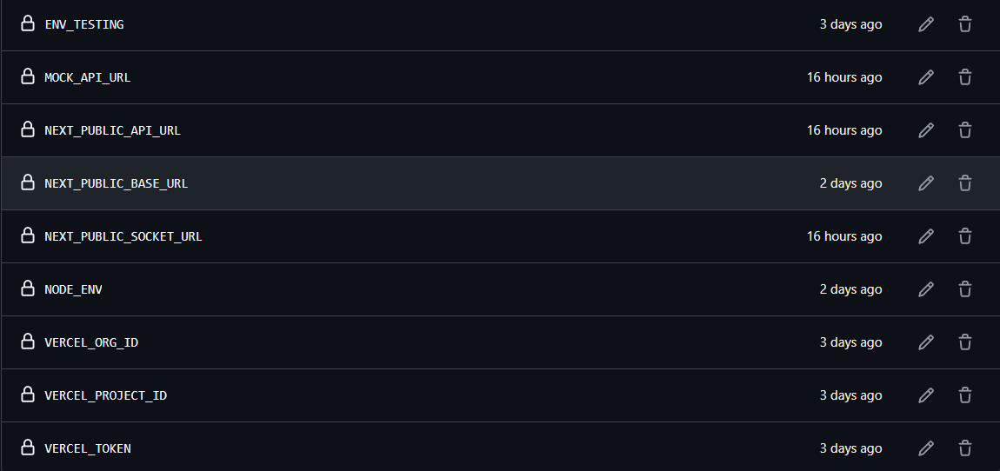

# Collab Doc Creator

A real-time collaborative document editor. Create documents, share them with others, and edit together with live sync — including offline support that catches up when you reconnect.

This repository is the **frontend**. It talks to a separate backend API and Socket.IO server for auth, persistence, and realtime updates.

---

## Features

- **Authentication** — Register, log in, and stay signed in with a JWT cookie. Protected routes keep unauthenticated users out.
- **Document management** — Create documents by topic, browse your list, and open shared links.
- **Rich text editing** — TipTap-powered editor with headings, formatting, highlight, and text alignment.
- **Realtime collaboration** — Changes sync across clients using Yjs (CRDT) over Socket.IO.
- **Role-based access** — `OWNER` and `EDITOR` can edit; `VIEWER` is read-only. Share links for either role.
- **Collaborators** — See who has access to a document.
- **Offline editing** — Local IndexedDB cache queues updates and flushes them when you’re back online.
- **Profile** — View your account details from the header.

---

## Tech stack

- Framework                                  # Next.js 16 (App Router), React 19, TypeScript
- Styling                                    # Tailwind CSS v4
- Data fetching                              # TanStack React Query, Axios 
- Forms & validation                         # React Hook Form, Zod 
- Document Editor                            # TipTap 
-  Collaboration                             # Yjs, y-prosemirror, Socket.IO client
-  Offline storage                           # IndexedDB (`idb`) 
- Notifications                              # Sonner
- Unit tests                                 # Jest, Testing Library 
- E2E tests                                  # Playwright
- Automated Testing and Deployment Pipeline  # Github Actions
- Deploy                                     # Vercel 

---

## Architecture

The app follows a feature-based layout. Each domain owns its API calls, services, hooks, and UI.

```
UI (pages / components)
  → hooks (React Query)
    → services
      → API clients (Axios / Socket.IO)
        → /api-proxy → backend API
```

Browser requests go through a same-origin **API proxy** (`/api-proxy/...`) so auth cookies stay on this app’s domain while the server forwards traffic to the backend.

Realtime editing uses Socket.IO directly against `NEXT_PUBLIC_SOCKET_URL`. Document updates are applied with Yjs so concurrent edits merge cleanly.

### Main routes

| Path                              | Description                      |
|-----------------------------------|----------------------------------|
| `/`                               | Redirects to login               |
| `/login`, `/register`             | Public auth pages                |
| `/documents`                      | Your document list (protected)   |
| `/create-document`                | Create a new document (protected)|
| `/documents/[id]/[documentToken]` | Collaborative editor (protected) |

### Backend endpoints used

- `POST /auth/` — Register
- `POST /auth/login` — Login
- `GET /auth/check-user-auth` — Checking user authentication
- `GET /user/profile` — Current user
- `GET` / `POST /document` — List and create documents
- `GET /document/:documentToken` — Open by share token
- `GET` / `POST /document/:documentId/collaborators` — Collaborators

### Socket events

- `document:join` → receives `document:load`
- `document:update` — send and receive live Yjs updates

---

## Prerequisites

- **Node.js 22** (matches CI)
- **npm**
- A running **backend** (API + Socket.IO), either local or the deployed instance

---

## Getting started

### 1. Clone and install

```bash
git clone https://github.com/roshidhmohammed/colloborative-document-editor-frontend.git
cd colloborative-document-editor-frontend
npm install
```

### 2. Configure environment

Env files are loaded by script (they are gitignored). Create the ones you need at the project root:

**`.env.development`** (used by `npm run dev`):

```bash
NEXT_PUBLIC_APP_ENV=development
NEXT_PUBLIC_API_URL=http://localhost:<backend-port>/api
NEXT_PUBLIC_SOCKET_URL=http://localhost:<backend-port>/
```

**`.env.testing`** (unit and e2e tests):

```bash
NEXT_PUBLIC_APP_ENV=testing
NEXT_PUBLIC_API_URL=https://colloborative-doc-editor-backend.onrender.com/api
NEXT_PUBLIC_SOCKET_URL=https://colloborative-doc-editor-backend.onrender.com/
NEXT_PUBLIC_BASE_URL=http://localhost:3000
```

**`.env.production`** (used by `npm start`):

```bash
NEXT_PUBLIC_APP_ENV=production
NEXT_PUBLIC_API_URL=<your-production-api>/api
NEXT_PUBLIC_SOCKET_URL=<your-production-socket-origin>/
```

| Variable                | Purpose                                                   |
|-------------------------|-----------------------------------------------------------|
| `NEXT_PUBLIC_APP_ENV`   | Environment label (`development`, `testing`, `production`)|
| `NEXT_PUBLIC_API_URL`   | Backend REST API base URL                                 |
| `NEXT_PUBLIC_SOCKET_URL`| Backend Socket.IO origin                                  |
| `NEXT_PUBLIC_BASE_URL`  | App origin (mainly for tests)                             |

### 3. Run the app

```bash
npm run dev
```

Open [http://localhost:3000](http://localhost:3000).

Make sure the backend is reachable at the URLs you set above — without it, auth and documents will fail.

---

## Available scripts

| Command | What it does |
|---------|----------------|
| `npm run dev` | Start the Next.js dev server with `.env.development` |
| `npm run build` | Create a production build |
| `npm start` | Run the production server with `.env.production` |
| `npm run lint` | Run ESLint |
| `npm run lint:fix` | Fix ESLint issues where possible |
| `npm test` / `npm run test:unit` | Run Jest unit tests |
| `npm run test:watch` | Jest in watch mode |
| `npm run test:coverage` | Unit tests with coverage |
| `npm run test:e2e` | Playwright end-to-end tests |
| `npm run test:e2e:ui` | Playwright UI mode |
| `npm run test:e2e:headed` | E2E in a visible browser |
| `npm run test:e2e:debug` | Playwright debug mode |
| `npm run test:e2e:report` | Open the last Playwright report |

---

## Project structure

```
src/
├── app/                    # Next.js App Router pages and API proxy
│   ├── (auth)/             # Login and register
│   ├── (documents)/        # Documents list, create, and editor
│   └── api-proxy/          # Server-side proxy to the backend API
├── features/               # Domain modules
│   ├── auth/
│   ├── documents/
│   ├── documentEditor/     # TipTap, Yjs, sockets, share, offline sync
│   ├── collaborators/
│   └── user/
├── components/             # Shared layout and UI primitives
├── providers/              # React Query, toasts, socket helpers
├── lib/                    # Axios, socket client, auth helpers, IndexedDB
├── config/                 # Environment config
├── constants/              # API endpoints and page routes
├── types/                  # Shared TypeScript types
└── utils/                  # Small helpers (e.g. className merge)

__tests__/
├── unit/                   # Jest + Testing Library
└── e2e/                    # Playwright specs and page objects
```

Feature folders typically mirror this flow: `api` → `services` → `hooks` → `components`, plus `types` and Zod `schemas` where needed.

---

## How key parts work

### Auth

Login runs through a Next.js server action. On success, a JWT is stored in a `token` cookie (1-day lifetime). Route protection checks that cookie against the backend before allowing access to document pages. Logged-in users who hit login or register are redirected away.

### Collaboration

When you open a document:

1. The client joins a Socket.IO room for that document.
2. Existing Yjs state is loaded.
3. Local edits are encoded and broadcast; remote updates are applied into the editor.
4. Role (`OWNER` / `EDITOR` / `VIEWER`) controls whether the editor is writable.

### Offline support

Yjs updates are stored in IndexedDB (`document-editor-db`). If the network drops, changes queue in a pending-updates store and sync when connectivity returns.

### Sharing

From the editor you can copy share URLs for **viewer** or **editor** access. Recipients open `/documents/{id}/{token}` with the token the backend issued for that role.

---

## Testing

- **Unit tests** cover hooks, components, and utilities under `__tests__/unit`.
- **E2E tests** cover auth, authorization, and document flows under `__tests__/e2e`.

```bash
npm run test:unit
npm run test:e2e
```

E2E expects a reachable backend (or the URLs in `.env.testing`). CI writes testing env from repository secrets.

---


## Github actions configuration

- Add the env variables in the github actions secret section- 
  1. Open your github repo, and go to setting tab
  2. Then click the "Secrets and variables", and click the "actions" button in the sidebar.
  3. Click "New Repository Secret" button, and add the ENV variables and vercel project credentials like below:
  

## Deployment

The app deploys to **Vercel**.

- Pull requests and pushes to `dev` run lint/build/test workflows.
- Pushes to `main` run tests, then build and deploy to production via the Vercel CLI.
- `vercel.json` sets Next.js as the framework and adds basic security headers (`X-Content-Type-Options`, `X-Frame-Options`, `Referrer-Policy`).

Production needs `NEXT_PUBLIC_API_URL` and `NEXT_PUBLIC_SOCKET_URL` pointed at your live backend.

---

## Related backend

Persistence and socket rooms live in the companion backend (example host used in testing: `colloborative-doc-editor-backend.onrender.com`). This frontend does not include a database; Mongo-style IDs in the types reflect the backend’s data model.

Backend is hosted in thus domain:  `https://colloborative-doc-editor-backend-production.up.railway.app`

---

